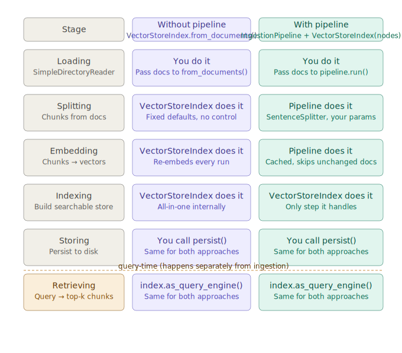
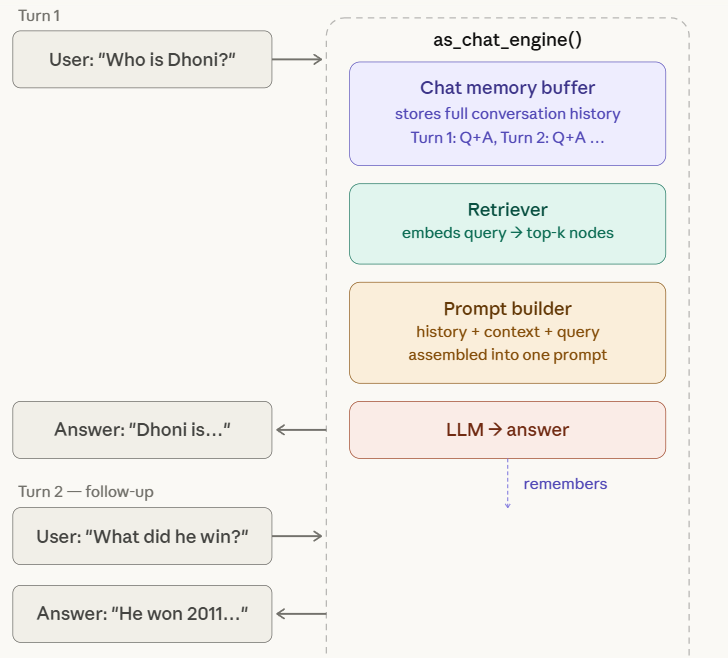

## **Core Components in LlamaIndex**
```    
    1. Document
    2. Node
    3. Index 
    4. Retriever
    5. QueryEngine
```

----------------------------------------------------------------------------------------------------------------

## **🔥 🔥 🔥 What is Document ? 🔥 🔥 🔥**
```
=> A Document is the canonical ingestion unit in LlamaIndex.
=> It represents a complete piece of source data along with its context, before any transformation into Nodes.
```

**Core Structure of a Document**
```python 

Document(
    id_ = "6687f74e-308f-4e07-82f8-6343ae300a63",
    text = "Mahendra Singh Dhoni ... ICC Champions Trophy...",
    embedding = None,
    metadata = {
        "file_path": ".../msdhoni.txt",
        "file_name": "msdhoni.txt",
        "file_type": "text/plain",
        "file_size": 2264,
        "creation_date": "2026-03-23",
        "last_modified_date": "2026-03-23"
    },
    relationships = {},
    excluded_embed_metadata_keys = [
        "file_name",
        "file_type",
        "file_size",
        "creation_date",
        "last_modified_date",
        "last_accessed_date"
    ],
    excluded_llm_metadata_keys = [
        "file_name",
        "file_type",
        "file_size",
        "creation_date",
        "last_modified_date",
        "last_accessed_date"
    ],
    metadata_template = "{key}: {value}",
    metadata_separator = "\n",
    text_template = "{metadata_str}\n\n{content}"
)
```
**Understanding Fields of "Document" Object:**
```
    1. text => The actual content It Can be: plain text, extracted PDF text, HTML cleaned content, code
    2. metadata => A dictionary that carries structured context.
            metadata = {
            "source": "notion",
            "author": "John",
            "date": "2024-01-01",
            "file_name": "report.pdf",
            "category": "finance"
        }
    3. id_ => Unique identifier for the document
    4. embedding => (optional, rarely used directly) Precomputed embedding of the whole document
    5. relationships =>  Connects documents to other objects, Examples: parent-child hierarchy, source references
```
---------------------------------------------------------------------------------------------------------------
## **🔥 🔥 🔥 What is Node ? 🔥 🔥 🔥** 

```
=> A Node is the atomic unit of retrieval and reasoning.
=> A 'Document' is raw-data that is splitted into multiple chunks called 'Nodes'.
=> If Document = raw data
   then Node = LLM-ready, retrievable knowledge chunk

=> Everything in LlamaIndex—retrieval, ranking, synthesis—operates on Nodes, not Documents.
```

**Core Structure of a Node**
```python 
TextNode(
    id_ = "260abbe9-9b1e-4731-9f44-2cc11f473877",
    text = "Mahendra Singh Dhoni ... ICC Champions Trophy...",
    embedding = [0.023, -0.451, 0.812, ...],  # filled AFTER embed model runs
    metadata = {
        "file_path": ".../msdhoni.txt",
        "file_name": "msdhoni.txt",
        "file_type": "text/plain",
        "file_size": 2264,
        "creation_date": "2026-03-23",
        "last_modified_date": "2026-03-23",
        "document_title": "...",       # added by TitleExtractor() in injestion-pipeline
        "excerpt_keywords": "...",     # added by KeywordExtractor() in injestion-pipeline
        "section_summary":"...",       # added by summaryExtractor() in injestion-pipeline
    },
    relationships = {
        SOURCE: {
            node_id: "abed3ce3-...",
            type: DOCUMENT
        },
        NEXT: {
            node_id: "2690b22a-...",
            type: TEXT
        },
        PREVIOUS: {                    
            node_id: "...",
            type: TEXT
        }
    },
    start_char_idx = 0,
    end_char_idx = 692,
    mimetype = "text/plain"
)
```

## **🔥 🔥 🔥  🔄 Document → Node Conversion (Full Pipeline) 🔥 🔥 🔥**

```
Step 1: 
Start with Document
documents = SimpleDirectoryReader("data").load_data()

Step 2: 
Node Parser (Splitter)=> It splits the Document into Nodes.

👉 Example:
from llama_index.core.node_parser import SimpleNodeParser
parser = SimpleNodeParser.from_defaults(
    chunk_size=512,
    chunk_overlap=50
)
nodes = parser.get_nodes_from_documents(documents)

Step 3:
What the parser actually does? 
    1. Reads document text
    2. Splits into chunks using: token limits, sentence boundaries, overlap
    3. Creates Node objects
    4. Copies metadata
    5. Adds relationships

Step 4: 
Chunking Strategy (very important)
🔹 Chunk Size
    Too small → loses context
    Too large → hurts retrieval accuracy
    Typical: 256–512 tokens

🔹Chunk Overlap
Ensures continuity between chunks
Normally 20% of the chunk_size

Step 5: 
Metadata Propagation=> Every node inherits document's metadata:
1.e. => doc.metadata → node.metadata

Step 6: 
Relationship Creation -> Parser automatically adds:

SOURCE → document id
PREVIOUS / NEXT → for ordering
```

**Why we need document , if node is enough to do everything ?**

```
1. Documents define the "source of truth"
    A Document represents:
        one file
        one API response
        one knowledge unit
    👉 Example:
        report.pdf = 1 Document
        notion_page = 1 Document

        But after chunking:
        1 Document → 50 Nodes

        Now imagine no Document layer:
        ❌ You now have 50 independent Nodes
        ❌ No clear idea they came from the same source

2. Updates & deletion become impossible (without Documents)

Let's say:
    You uploaded a PDF
    It became 100 Nodes

Now the PDF changes.

Without Documents:  You must track and delete 100 individual Nodes manually 😵
With Documents:     You just say:
                "Re-index this Document"
                Document gives:
                Lifecycle control (create / update / delete)

```
-----------------------------------------------------------------------------------------------------------------------


## **🔥 🔥 🔥 What is INDEX ? 🔥 🔥 🔥**

```
=> An Index in LlamaIndex is a data structure built over Nodes that enables efficient retrieval, traversal, and reasoning
=> Nodes = data, and Index = how you access that data
=> It is NOT just a vector database.
=> It defines:
    how Nodes are stored
    how they are searched
    how they are organized logically
```
**Internal Structure of an Index.**

```python 
    Index(
        nodes=[...],
        index_struct=...,
        storage_context=...,
        embed_model=...
    )

```

```
    1. nodes => Index is built on top of Nodes, It never works on Documents directly

    2. index_struct => It defines: how nodes are arranged, how retrieval happens

    3. storage_context => Handles: where embeddings are stored, persistence (disk, DB, vector DB)

    4. embed_model => Converts node text → vectors (for vector indexes)
```

**🔥 Types of Indexes**

```
    🧩 1. VectorStoreIndex (most used)
    🧩 2. ListIndex (Sequential Index)
    🧩 3. TreeIndex (Hierarchical)
    🧩 4. KeywordTableIndex
```

------------------------------------------------------------------------------------------------------------------------------

## **🔥 🔥 🔥VectorStoreIndex  🔥 🔥 🔥**

``` 
=> VectorStoreIndex is an index that:
   - "Performs Splitting" ONLY when using from_documents() else uses default settings(SentenceSplitter with default chunk size)
   - "Embeds nodes" into vector space (or accepts pre-embedded nodes)
   - "Indexes" those vectors for fast lookup
   - "Powers as_query_engine()" to retrieve top-k nodes via similarity search

=> Retrieval via semantic similarity
```

**How VectorStoreIndex works ?**
```
Node → embedding vector
Query → embedding vector
Compute similarity
Return top-k nodes

Example: 
from llama_index.core import VectorStoreIndex
index = VectorStoreIndex(nodes)
```

**Workflow of VectorStoreIndex**
```
Nodes
  ↓
Embedding Model
  ↓
Vector Store
  ↓
Retriever Interface

```

```
1. Nodes => Already chunked data, Each node = one embedding unit
2. Embedding Model =>  Converts text → vector
👉 Example:
embedding = embed_model.get_text_embedding(node.text)

📌 Output:
[0.12, -0.98, 0.44, ...]  # high-dimensional vector

3. Vector Store => This is where vectors live.
=> It Can be: in-memory (default), external DB:, Pinecone, FAISS, Weaviate, Redis


What is stored?


For each Node:
{
  embedding: [...],
  text: "...",
  metadata: {...},
  node_id: "..."
}

4. Index Wrapper => VectorStoreIndex wraps: vector store, embedding logic, retrieval interface

```
**Understanding Different Role of VectorStoreIndex with & without Injestion_Pipeline**
<p align="center">

</p>

CheckOut Injestion_Pipeline here --> [Link to the Injestion-Pipeline](./2_Injestion_Pipeline.md)

------------------------------------------------------------------------------------------------------------------------------

 ## **🔥 🔥 🔥 Retriever  🔥 🔥 🔥**  

```
=> A retriever in LlamaIndex is: The component that finds the most relevant chunks (nodes) from your data based on a query.

In a RAG pipeline:
Documents → split into Nodes
Nodes → converted to embeddings
Stored in vector index
Retriever → pulls relevant nodes
LLM → answers using those nodes

```

 🔥**What is Semantic search ?**
```
Converts query → embedding
Compares with stored embeddings
Finds most similar nodes
Returns top K results
👉 This is called semantic search

Example:
retriever = index.as_retriever(k=3)
nodes = retriever.retrieve("What is AI?")

We can apply "filters" also : 
👉 Only search inside specific data
retriever = index.as_retriever( similarity_top_k=3,  filters=MetadataFilters(
        filters=[
            ExactMatchFilter(key="file_name", value="msdhoni.txt")
        ]
    ))

```
🔥**as_retriever()**  
```
=> search engine only 
=> generates EMBEDDINGS, perform SEARCH , perform RANKING 
=> Output in forms of Nodes
=> No LLM call
=> as_retriever() is stateless, every query is independent, no memory
```
Example Code:

```py
retriever = index.as_retriever(similarity_top_k=3)
nodes = retriever.retrieve("What did Dhoni win in 2011?")

for node in nodes:
    print(node.score)             # similarity score  e.g. 0.87
    print(node.node.text)         # chunk text
    print(node.node.metadata)     # file_name, keywords etc.
    print(node.node.node_id)      # unique id
```

🔥**as_query_engine()**
```
=> search engine + ChatGPT
=> generates EMBEDDINGS, perform SEARCH , perform RANKING , LLM-Generation , gives ANSWERS 
=> LLM call per query
=> Output in forms of final answer
=> query_engine is stateless, every query is independent, no memory
```
Example Code:

```py
query_engine = index.as_query_engine(similarity_top_k=3)
response = query_engine.query("What did Dhoni win in 2011?")

print(response.response)          # final answer string
print(response.source_nodes)      # list of NodeWithScore used
```

🔥 **as_chat_engine()** 
```
=> is used to turn your index into a conversational system, basically a chatbot that can remember context across multiple turns.
=> chat_engine is stateful, remembers all previous turns in session
```
<p align="center">

</p>

Example Code: 
```py
chat_engine = index.as_chat_engine(
    chat_mode="condense_plus_context",   # condenses history + retrieves context
    similarity_top_k=3,
    filters=MetadataFilters(filters=[
        ExactMatchFilter(key="file_name", value="msdhoni.txt")
    ]),
    verbose=True,
)

response1= chat_engine.chat("Whom we are talking about ?")
print(response1)
response2= chat_engine.chat("who is he ?")
print(response2)

```

**⚙️What operations as_chat_engine() performs?**
```
=> as_chat_engine() builds on top of retrieval + generation, but adds memory.
=> LLM call per message (often multiple calls)

=> Maintain conversation history
=> Converts current query (and sometimes history) into vector
=> Fetches relevant nodes from index
=> Combines:retrieved data & chat history
=> Generates a conversational response
```

**What VectorStoreIndex does at query time**

```
Step 1 — embeds the query using same embed model as ingestion.
Step 2 — computes cosine similarity vs every stored vector.
Step 3 — returns top-k nodes sorted by score (highest first).
```


 ## **🔥 🔥 🔥 Query Engine  🔥 🔥 🔥** 

**What is a Query?**

```
A query is the full pipeline that takes a natural language
question and returns a grounded answer from your indexed docs.

Internally it has 5 steps:
  1. Query Embedding
  2. Retrieval
  3. Node Postprocessing  (optional)
  4. Response Synthesis
  5. LLM Answer
```
*Step 1 — Query Embedding*
```

- User query text → dense vector
- Uses SAME embed model as ingestion (critical)
- Mismatch = wrong results, no error thrown

Settings.embed_model = HuggingFaceEmbedding(
    model_name="BAAI/bge-small-en-v1.5"
)
# must be same model used during pipeline.run()
```


*Step 2 — Retrieval*
```
- Cosine similarity between query vector and all node vectors
- Returns top-k nodes sorted by score (highest first)
- Score range: 0.0 (no match) → 1.0 (perfect match)

query_engine = index.as_query_engine(similarity_top_k=3)
=> similarity_top_k controls how many nodes returned

=> Score interpretation:
    0.9+  → very relevant
    0.7   → moderately relevant
    0.5-  → likely irrelevant, may confuse LLM
```

*Step 3 — Node Postprocessors (optional)*

```
Postprocessors filter or rerank nodes AFTER retrieval
but BEFORE sending to LLM.
```
```py 
from llama_index.core.postprocessor import (
    SimilarityPostprocessor,
    KeywordNodePostprocessor,
)

# Filter out low-score nodes
query_engine = index.as_query_engine(
    similarity_top_k=5,
    node_postprocessors=[
        SimilarityPostprocessor(similarity_cutoff=0.7)
        # drops any node with score < 0.7
    ]
)

# Filter by keyword presence
query_engine = index.as_query_engine(
    node_postprocessors=[
        KeywordNodePostprocessor(
            required_keywords=["Dhoni"],   # node MUST have this
            exclude_keywords=["Kohli"]     # node must NOT have this
        )
    ]
)
```

*Step 4 — Response Synthesizer*

```
Assembles the final prompt sent to LLM:

  System:  "You are a helpful assistant.
            Answer only from the context below."
  Context: <node1 text>
           <node2 text>
           <node3 text>
  Question: <user query>
  Answer:
```

```py
# Response modes — how context is used:
from llama_index.core import get_response_synthesizer
from llama_index.core.response_synthesizers import ResponseMode

# COMPACT (default) — fits all nodes into one prompt
query_engine = index.as_query_engine(
    response_mode=ResponseMode.COMPACT
)

# REFINE — sends nodes one by one, refines answer iteratively
# best for long/complex answers, more LLM calls
query_engine = index.as_query_engine(
    response_mode=ResponseMode.REFINE
)

# TREE_SUMMARIZE — builds tree of summaries bottom-up
# best for summarization tasks
query_engine = index.as_query_engine(
    response_mode=ResponseMode.TREE_SUMMARIZE
)

# NO_TEXT — returns nodes only, skips LLM entirely
query_engine = index.as_query_engine(
    response_mode=ResponseMode.NO_TEXT
)
```


*Step 5 — LLM Answer*

```py
Settings.llm = Groq(
    model="llama3-8b-8192",
    api_key=os.getenv("GROQ_API_KEY")
)
# LLM receives assembled prompt → returns answer string
# answer is grounded in retrieved context only
```

