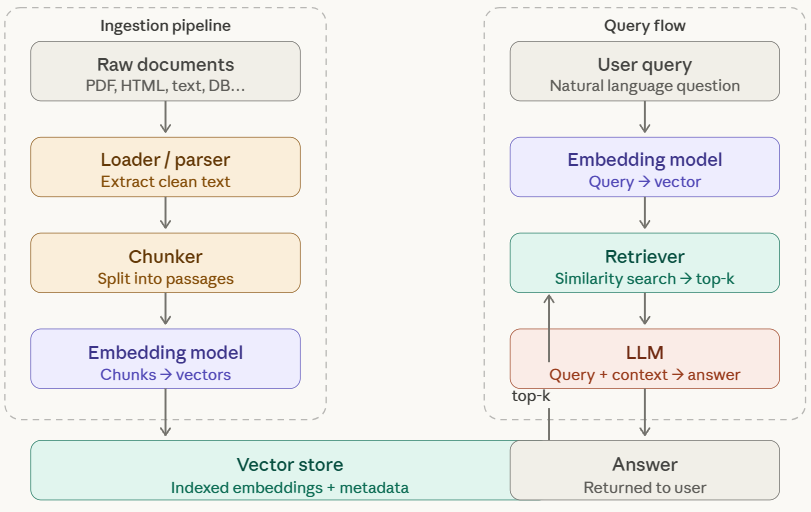

## 🔥 🔥 🔥 **Injestion Pipeline** 🔥 🔥 🔥


**What is it?**

```
IngestionPipeline is a chain of transformations that processes rawdocuments into fully enriched, embedded Nodes ready for indexing.

It runs ONCE at ingestion time (not at query time).
```

**Why use it over VectorStoreIndex.from_documents()?**
```
- Full control over every step
- Document hash cache → skips re-processing unchanged docs
- Add metadata extractors (title, keywords, summary)
- Incremental updates — only new/changed docs are re-processed
```

<p align="center">
 
</p>

## ***Understanding the Workflow of Injestion_Pipeline***

**Stage 1 — Loading**

```py
 # SimpleDirectoryReader auto-detects file types (.txt, .pdf, etc.)
    documents = SimpleDirectoryReader("./data", required_exts=[".txt"], num_files_limit=4).load_data()
    print(f"  Loaded {len(documents)} document(s):")
    for doc in documents:
        # Metadata includes the source filename
        name = doc.metadata["file_name"]
        print(f"    • {name}  ({len(doc.text)} chars)")
```

```
Adds to each Document automatically:
  file_name, file_path, file_type, file_size,
  creation_date, last_modified_date
```

**Stage 2 — Pipeline (transformations chain)**
```py
print("\n⚙️  Running ingestion pipeline...")

pipeline = IngestionPipeline(
    transformations=[
        # 1. Split text into overlapping sentence-aware chunks
        SentenceSplitter(
            chunk_size=CHUNK_SIZE,
            chunk_overlap=CHUNK_OVERLAP,
        ),
        # 2. Auto-extract a descriptive title for each node
        TitleExtractor(
            nodes=5,           # Look at first 5 nodes for title generation
            metadata_mode=MetadataMode.EMBED,
        ),
        # 3. Extract relevant keywords per node
        KeywordExtractor(
            keywords=5,        # Up to 5 keywords per chunk
            metadata_mode=MetadataMode.EMBED,
        ),
        # 4. Extract Summary per node
        SummaryExtractor(),

        # 5. Embed each chunk into a vector
        Settings.embed_model,
    ]
)

nodes = pipeline.run(documents=documents, show_progress=True)
```

**Full Node structure after pipeline runs**
```py 

TextNode(
    id_            = "260abbe9-...",          # unique UUID
    text           = "chunk text here...",    # from SentenceSplitter
    embedding      = [0.023, -0.451, ...],    # from embed model
    mimetype       = "text/plain",
    start_char_idx = 0,                       # position in original doc
    end_char_idx   = 692,

    metadata = {
        # from SimpleDirectoryReader
        "file_name":          "msdhoni.txt",
        "file_path":          "./data/msdhoni.txt",
        "file_type":          "text/plain",
        "file_size":          2264,
        "creation_date":      "2026-03-23",
        "last_modified_date": "2026-03-23",

        # from TitleExtractor
        "document_title":     "Mahendra Singh Dhoni",

        # from KeywordExtractor
        "excerpt_keywords":   "Dhoni, CSK, ICC, captain, wicketkeeper",

        # from SummaryExtractor
        "section_summary":    "This section discusses Dhoni's leadership...",
    },

    relationships = {
        SOURCE:   { node_id: "abed3ce3-...", type: DOCUMENT },
        PREVIOUS: { node_id: "...",          type: TEXT },
        NEXT:     { node_id: "2690b22a-...", type: TEXT },
    },

    excluded_embed_metadata_keys = [],  # hide from embedding
    excluded_llm_metadata_keys   = [],  # hide from LLM context
)

```


**Stage 3 — Indexing**
```py 
index = VectorStoreIndex(nodes)
# Only does: indexing + storing in memory
# Skips: splitting and embedding (already done by pipeline)
```

**Stage 4 — Persisting & Reloading (NOT automatic)**
```py 
index.storage_context.persist(persist_dir="./storage")
# Saves:
#   docstore.json      → node text + metadata
#   vector_store.json  → embedding vectors
#   index_store.json   → index structure

# Reload later (no re-embedding):
print(f"\n🔄 Reloading index from '{PERSIST_DIR}'...")
storage_context = StorageContext.from_defaults(persist_dir=PERSIST_DIR)
index = load_index_from_storage(storage_context)
print("  Index reloaded successfully.")
```
