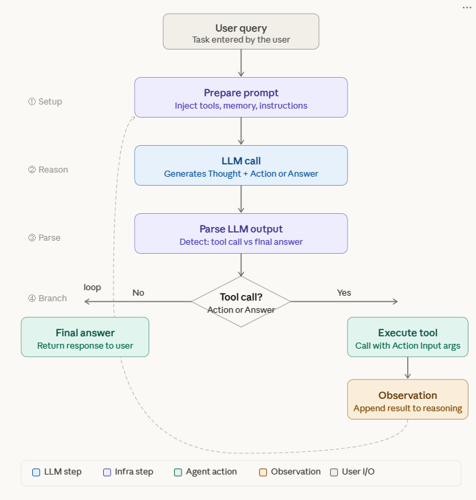
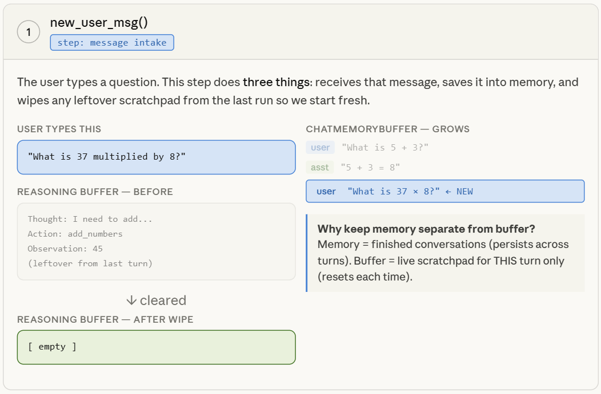
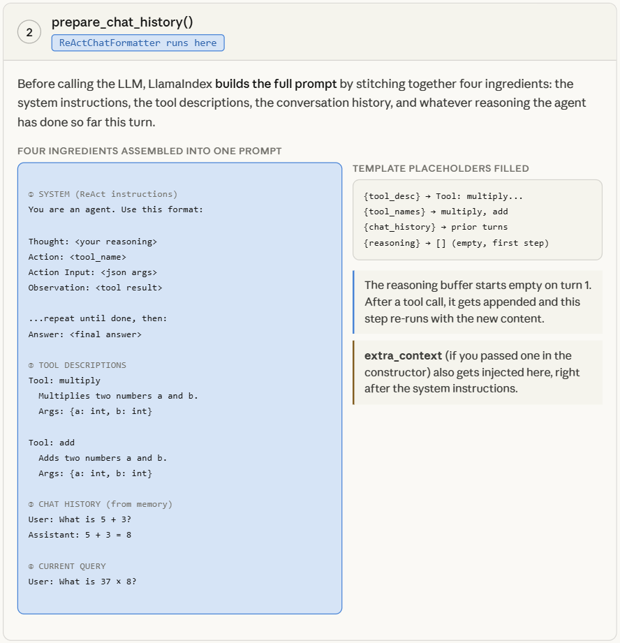
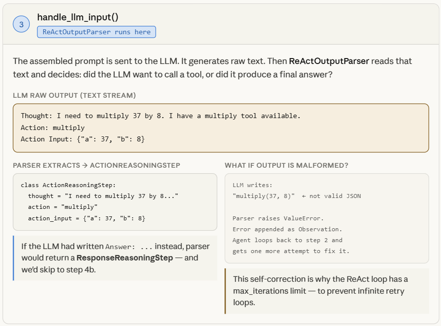
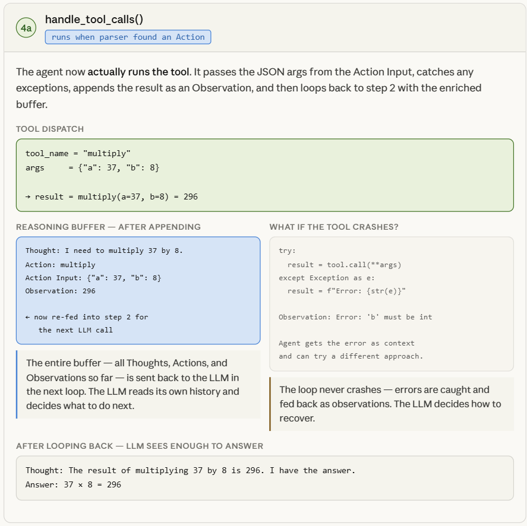
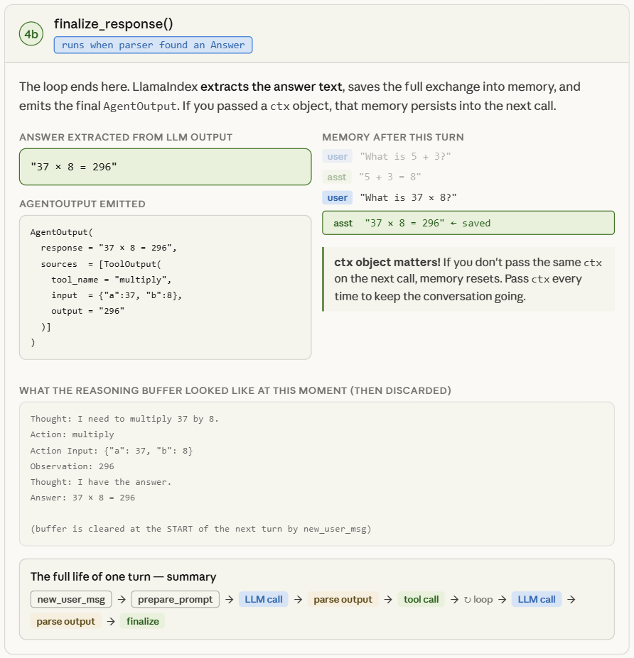

## 🔥 🔥 🔥  **What is ReAct?**
```
=> ReAct stands for Reason and Act — a prompting technique that enables LLMs to break down complex tasks into a sequence of thought processes, actions, and observations. 
=> It combines reasoning and acting to allow models to reason step-by-step before deciding which tool to call or whether to answer directly

```
**🔥Where Does ReActAgent Live in LlamaIndex?**
```
LlamaIndex has two generations of the ReAct agent:

Modern (recommended) — llama_index.core.agent.workflow:
pythonfrom llama_index.core.agent.workflow import ReActAgent

Legacy — llama_index.core.agent:
pythonfrom llama_index.core.agent import ReActAgent
```

**🔥Core Concept: The ReAct Loop**
```
For each interaction, the ReAct agent enters a reasoning and acting loop:

Decide whether to use a tool, and which one, given the user input.
Call that tool and observe its output.
Based on the output, either repeat the loop or produce a final answer.
``` 

🔥**The loop follows a strict text format:**
```
Thought: reasoning about what to do next
Action: the tool name to call
Action Input: JSON arguments for the tool
Observation: result from the tool
.....
.....
…repeat until… 
.....
.....
Answer: final response to the 
```

## 🔥🔥🔥**ReActAgent Class Signature**

The class definition (as a Workflow subclass) looks like:
```py
pythonclass ReActAgent(Workflow):
    def __init__(
        self,
        *args: Any,
        llm: LLM | None = None,
        tools: list[BaseTool] | None = None,
        extra_context: str | None = None,
        **kwargs: Any,
    ) -> None:
        ...
        self.formatter = ReActChatFormatter.from_defaults(context=extra_context or "")
        self.output_parser = ReActOutputParser()
```


## 🔥🔥🔥**Function Agent vs ReAct Agent**

### **1. Function Agent** 
```
=> FunctionAgent is an agent that uses structured function (tool) calling.
=> 👉 The LLM does not “think in text steps”, it directly outputs structured tool calls.
=> You define functions (tools) with clear schemas (name, inputs, outputs)
```

**🧠 How it works**
```
The LLM:
    Chooses a function
    Fills arguments in JSON format
    Executes the function
    Uses the result to continue 
```
        
**💡 When to use**
```
=>  You want reliable, production-grade workflows
=>  You need strict input/output formats
=>  You are integrating APIs, databases, or automation
```

**➡️ Internally:**
```
=>  LLM selects get_weather
=>  Passes { "city": "Delhi" }
=>  Returns result cleanly

```
### **2.  ReAct Agent (Reason + Act approach)**
```
=> ReActAgent implements the ReAct paradigm (Reasoning + Acting), introduced in the paper
=> 👉 The LLM explicitly reasons step-by-step in natural language before acting.
```

**🧠 How it works**
```
    The LLM generates a chain of thought loop:
    Thought → reasoning step
    Action → choose tool
    Observation → result
    Repeat until final answer
```
**💡 When to use**
```
    You want transparent reasoning
    Tasks require multi-step thinking
    Exploration / research-style queries
```

**➡️ Internally:**
```
    Thought: I need to find PM of India
    Action: search("PM of India")
    Observation: Narendra Modi
    Thought: Now find his age
    Action: search("Narendra Modi age")
    Observation: 73
    Final Answer: ...
```
        
**🔥 Note :** 
```
=>  If the LLM you are using supports tool calling, you can use the FunctionAgent class. 
=>  Otherwise, you can use the ReActAgent class.
```     
## 🔥🔥🔥**Workflow of ReAct Agent**
<p align="center">

</p>

## 🔥🔥🔥**Lets Understand the workflow one by one :**

**🔥Step-1.   new_user_msg()**
```
1. This is the very first thing that fires the moment you call agent.run("your question") — nothing else happens before it.

2. It takes the raw string the user typed and wraps it into a ChatMessage(role="user", content="...") object that LlamaIndex can work with internally.

3. It appends that message object to the ChatMemoryBuffer — this is the long-term memory that survives across multiple .run() calls if you reuse the same ctx.

4. It then wipes the reasoning scratchpad clean. The scratchpad is a temporary list of Thought/Action/Observation strings built up during the previous turn — all of that gets deleted so the new turn starts with zero baggage.

5. The reason memory and scratchpad are kept separate is intentional: memory holds completed conversations the LLM can reference for context, while the scratchpad holds in-progress reasoning that's only relevant for the current question.

6. If this is the very first message ever (no prior history), the memory buffer simply has one item in it after this step.

7. If you are on turn 3 of a conversation, memory now has 5 items (2 user + 2 assistant from before, plus the new user message) — and the scratchpad still resets to empty regardless.

8. No LLM is called here. This step is pure bookkeeping — fast, deterministic, no AI involved.
```
<p align="center">

</p>

**🔥Step-2.   prepare_chat_history()**
```
1. This step is where ReActChatFormatter runs — its job is to take all the ingredients and bake them into one single prompt string that the LLM will receive.

2. Ingredient one is the ReAct system prompt — a set of instructions telling the LLM exactly what format to follow: always start with Thought:, then Action:, then Action Input: in JSON, and finally either loop or write Answer:.

3. Ingredient two is the tool descriptions — for every tool registered with the agent, it writes out the tool's name, its docstring description, and its argument schema. This is how the LLM knows what tools exist and how to call them.

4. Ingredient three is the chat history from ChatMemoryBuffer — the previous completed exchanges (user messages + assistant answers) are injected so the LLM has conversational context.

5. Ingredient four is the current reasoning buffer — if this is the first time through the loop this turn, the buffer is empty. But if a tool was just called and returned an Observation, the buffer now contains Thought → Action → Action Input → Observation from the last round, and all of that gets injected too.

6. The {tool_desc} and {tool_names} placeholders in the system prompt template are filled in dynamically from whatever tools you passed to the constructor — swap your tools and the prompt automatically changes.

7. If you passed extra_context when creating the agent, it gets appended right after the system instructions and before the tool descriptions — useful for things like "always answer in Hindi" or "you are a financial assistant."

8. The final output of this step is a list of ChatMessage objects (system + history + current scratchpad) that gets handed off to the LLM in the next step.

9. This step runs every single time the loop iterates — meaning if the agent makes 3 tool calls, this function runs 4 times total (once before each LLM call), each time with a longer and longer scratchpad.
```

<p align="center">

</p>

**🔥Step-3.   handle_llm_input()**
```
1. This is the only step that actually talks to the LLM — it takes the fully assembled prompt from step 2 and sends it as an API call to whatever model you configured (GPT-4o, Claude, Gemini, a local model, anything).

2. It supports both streaming and non-streaming modes — in streaming mode, tokens come back one at a time and get emitted as AgentStream events you can listen to in real time.

3. Once the full response text arrives, ReActOutputParser reads it character by character looking for specific keywords: does it start with Thought: and contain Action:? Or does it contain Answer:?

4. If the parser finds Action: and Action Input:, it creates an ActionReasoningStep object with three fields: thought (the reasoning text), action (the tool name string), and action_input (the parsed JSON dict of arguments).

5. If the parser finds Answer:, it creates a ResponseReasoningStep object containing just the final answer text — and the loop will terminate after this.

6. If the LLM output is malformed — for example the JSON in Action Input is broken, or it wrote a tool name that doesn't exist — the parser raises a ValueError. That error gets caught, turned into an Observation string like "Error: could not parse action input", and appended to the scratchpad so the LLM can see what went wrong on its next attempt.

7. The LLM has no memory of its own between calls — every single call to the LLM is completely stateless. The only reason it appears to "remember" what it did is because the full scratchpad history is re-injected into the prompt every time by step 2.

8. This is also where max_iterations matters — LlamaIndex counts how many times this step has run this turn, and if it exceeds the limit (default 10), the agent stops and returns whatever it has.

9. The parsed reasoning step object (either Action or Answer) is returned and passed to the branching logic that decides whether to go to step 4a or 4b.
```

<p align="center">

</p>

**🔥Step-4(a).   handle_tool_calls()**
```
1. This step only runs when step 3 returned an ActionReasoningStep — meaning the LLM decided it needs to use a tool rather than answer directly.

2. It looks up the tool by name in the agent's tool registry — the action field from the step object is matched against the list of tools you registered. If no tool with that name exists, the error is fed back as an Observation.

3. It calls the tool function with the action_input dict unpacked as keyword arguments — so {"a": 37, "b": 8} becomes multiply(a=37, b=8) behind the scenes.

4. The entire tool call is wrapped in a try/except block — if the tool raises any exception (wrong argument types, network failure, division by zero, anything), the exception message is caught and converted into an Observation string rather than crashing the agent.

5. The result from the tool (a string, number, dict — whatever the tool returns) is serialized to a string and becomes the Observation.

6. That Observation is appended to the reasoning scratchpad, so the buffer now reads: Thought: ... → Action: multiply → Action Input: {"a":37,"b":8} → Observation: 296.

7. Control immediately loops back to step 2 — prepare_chat_history() runs again, this time with the enriched scratchpad, and step 3 calls the LLM again with the new context.

8. The LLM will now read its own prior Thought + Action + the Observation of what actually happened, and from that it decides whether it needs another tool call or has enough to answer.

9. Multiple tool calls in one turn each go through this step independently — the scratchpad simply grows with each iteration: Thought → Action → Obs → Thought → Action → Obs → ... until the LLM writes Answer:.

10. A ToolOutput record is also saved for each call — this gets included in the final AgentOutput.sources list so you can inspect exactly which tools were called, with what arguments, and what they returned.
```

<p align="center">

</p>

**🔥Step-4(b).  finalize_response()**
```
1. This step only runs when step 3 returned a ResponseReasoningStep — meaning the LLM wrote Answer: instead of Action:, signalling it's done reasoning.

2. The answer text is extracted by slicing everything after the Answer: keyword in the LLM's raw output and stripping any whitespace.

3. The full exchange for this turn — the user's message and the assistant's final answer — is written into ChatMemoryBuffer as a completed pair. 

4. Only the clean final answer goes into memory, not the intermediate Thought/Action/Observation scratchpad.

5. The reasoning scratchpad itself is NOT saved to memory — it was a temporary working space and gets discarded. Next turn, new_user_msg() will wipe whatever is left of it.

6. An AgentOutput object is constructed containing the response text and a sources list — the sources list has one ToolOutput entry for every tool that was called during this turn, giving you full traceability.

7. If you are streaming, the final Answer: text was already being emitted token by token as AgentStream events during step 3 — finalize_response() just handles the bookkeeping after the fact.

8. The loop is now completely terminated — no more iterations, no more LLM calls, no more tool calls for this .run() invocation.

9. Whether or not the next .run() call remembers this conversation depends entirely on whether you pass the same ctx object — the ctx holds the memory buffer, so the same ctx = shared memory, a new ctx = fresh start.

10. If the agent hit max_iterations without ever writing Answer:, this step still runs but with whatever partial content the agent produced — it doesn't silently fail, it returns what it has with a note that the limit was reached.

```

<p align="center">

</p>