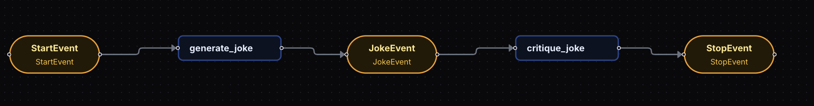
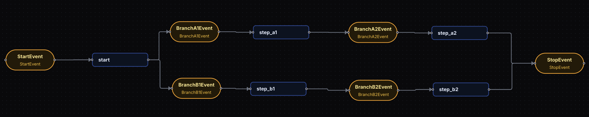

## 🔥🔥🔥**What is a Workflow?**
```
A Workflow in LlamaIndex is an event-driven, step-based system used to control how an AI application executes.

Instead of writing one long sequential program, the application is divided into:

🔥Steps → units of execution
🔥Events → messages that trigger steps

Each step:
    Receives an Event
    Performs some logic
    Emits another Event
    Triggers the next step

Execution Pattern:   Event → Step → Event → Step → ... → StopEvent
```
## 🔥🔥🔥**Why Workflows?**
```
As Generative AI applications grow, managing execution flow becomes difficult.

Typical AI applications involve:
    LLM calls
    Retrieval (RAG)
    Tool usage
    Validation
    Retries
    Branching logic
    Loops

Writing this as normal code quickly becomes complex and hard to maintain.
```

### **🔥Problems with DAG-based Systems**
```
Earlier frameworks used Directed Acyclic Graphs (DAGs), which had limitations:

    Loops and branches were difficult to represent.
    Data passing between nodes became complicated.
    Optional/default parameters caused confusion.
    Graph structures felt unnatural for Python developers.

Solution ? 
LlamaIndex Workflows use:

    Event-driven design 
    Normal Python functions
    Async execution
    Automatic step connections
```

### **🔥🔥Events**

```
Events are objects that carry data between workflow steps.
They act as both:
    a signal (something happened)
    a data container

Example:

class JokeEvent(Event):
    joke: str

This event carries a generated joke to the next step.
```

## 🔥🔥 **Special Events**

🔥**StartEvent**
```
It is Entry point of the workflow
It Contains initial user input

It gets Created automatically when running:     await workflow.run(topic="pirates")

Equivalent to:      StartEvent(topic="pirates")

```

🔥**StopEvent**
```
It Terminates the workflow
It Returns the final result

return StopEvent(result="Final Output")
```
🔥**Steps**
```
A Step is a function that performs work inside the workflow.

Defined using the @step decorator:

@step
async def generate_joke(self, ev: StartEvent) -> JokeEvent:

A step:

accepts one event type
performs processing
returns another event
```
🔥**Workflow Class**
```
A workflow is created by subclassing Workflow.

class JokeFlow(Workflow):

The workflow:
    collects all steps automatically
    connects steps based on event types
    validates execution before running

```

🔥**Automatic Event Routing**
```
You do not manually connect steps.

Connections are inferred from type hints.

Example:

generate_joke(...) -> JokeEvent
critique_joke(ev: JokeEvent)

LlamaIndex automatically understands:

generate_joke → critique_joke
```
**Understand with code**
```py
# ---- Workflow Imports (Correct Path) ----
from llama_index.core.workflow import Workflow, step
from llama_index.core.workflow.events import Event, StartEvent, StopEvent

# ---- LlamaIndex Settings ----
from llama_index.core import Settings
from llama_index.embeddings.huggingface import HuggingFaceEmbedding
from llama_index.llms.groq import Groq

# ---- Python ----
from dotenv import load_dotenv
import asyncio
import os

load_dotenv()

# Global Settings
Settings.embed_model = HuggingFaceEmbedding(
    model_name="BAAI/bge-small-en-v1.5"
)

Settings.llm = Groq(
    model="openai/gpt-oss-20b",
    api_key=os.getenv("GROQ_API_KEY"),
)

# Custom Event
class JokeEvent(Event):
    joke: str

# Workflow Definition
class JokeFlow(Workflow):

    @step
    async def generate_joke(self, ev: StartEvent) -> JokeEvent:
        topic = ev.topic

        prompt = f"Write your best joke about {topic}."
        response = await Settings.llm.acomplete(prompt)

        return JokeEvent(joke=str(response))

    @step
    async def critique_joke(self, ev: JokeEvent) -> StopEvent:
        joke = ev.joke

        prompt = f"Give a thorough analysis and critique of the following joke: {joke}"
        response = await Settings.llm.acomplete(prompt)

        return StopEvent(result=str(response))

# Async Entry Point 
async def main():
    w = JokeFlow(timeout=60, verbose=False)
    result = await w.run(topic="pirates")
    print(result)


if __name__ == "__main__":
    asyncio.run(main())
```

**Workflow Of the Code :** 
<p align="center">

</p>

----------------------------------------------------------------------------------------------------------------------------

## 🔥🔥🔥**Loops In Events**

```
A loop happens when a step returns the same event type again.

That means: workflow calls the same step again.
```
**🔄 What Happens Internally**
```
Example run: num_loops = 3

Execution:

StartEvent
   ↓
prepare_input → LoopEvent(3)

loop_step → LoopEvent(2)
loop_step → LoopEvent(1)
loop_step → LoopEvent(0)
loop_step → StopEvent

```

**Code to Understand Looping:** 
```py
# creating loop event 
from workflows.events import Event

class LoopEvent(Event):
    num_loops: int

# loop workflow
import random
from workflows import Workflow, step
from workflows.events import StartEvent, StopEvent

class LoopingWorkflow(Workflow):
    @step
    async def prepare_input(self, ev: StartEvent) -> LoopEvent:
        num_loops = random.randint(0, 10)
        return LoopEvent(num_loops=num_loops)

    @step
    async def loop_step(self, ev: LoopEvent) -> LoopEvent | StopEvent:
        if ev.num_loops <= 0:
            return StopEvent(result="Done looping!")

        return LoopEvent(num_loops=ev.num_loops-1)
```

## 🔥🔥🔥**Branching in Workflows**
```
Branching means:
    A workflow chooses different execution paths based on a condition.
    Instead of running steps in a fixed order, the workflow dynamically decides which step runs next.
```
**Workflow Of the Branching :** 
<p align="center">

</p>

**Code to Understand Branching:**
```py 
import random
from workflows import Workflow, step
from workflows.events import Event, StartEvent, StopEvent

class BranchA1Event(Event):
    payload: str

class BranchA2Event(Event):
    payload: str

class BranchB1Event(Event):
    payload: str

class BranchB2Event(Event):
    payload: str

class BranchWorkflow(Workflow):
    @step
    async def start(self, ev: StartEvent) -> BranchA1Event | BranchB1Event:
        if random.randint(0, 1) == 0:
            print("Go to branch A")
            return BranchA1Event(payload="Branch A")
        else:
            print("Go to branch B")
            return BranchB1Event(payload="Branch B")

    @step
    async def step_a1(self, ev: BranchA1Event) -> BranchA2Event:
        print(ev.payload)
        return BranchA2Event(payload=ev.payload)

    @step
    async def step_b1(self, ev: BranchB1Event) -> BranchB2Event:
        print(ev.payload)
        return BranchB2Event(payload=ev.payload)

    @step
    async def step_a2(self, ev: BranchA2Event) -> StopEvent:
        print(ev.payload)
        return StopEvent(result="Branch A complete.")

    @step
    async def step_b2(self, ev: BranchB2Event) -> StopEvent:
        print(ev.payload)
        return StopEvent(result="Branch B complete.")

```
------------------------------------------------------------------------------------------------------------------------------------
## 🔥🔥🔥**What is State?**
```
    State = Shared memory of a workflow.
    It allows different workflow steps to share information.

    Without state:  Each step works independently 
    With state:     Steps remember previous data 
```
🔥 **Managing State**
```
In LlamaIndex Workflows, steps execute independently.
To allow steps to share information, workflows provide a state store automatically.

This shared memory is accessed using:
Context → ctx.store
```
For More Please checkout: [ 5_Context.md ](5_Context.md)


**Terms of Managing State**
```
    Workflow → defines workflow
    Context → contains workflow runtime data
    step → marks workflow step
    StartEvent → workflow start trigger
    StopEvent → workflow end
```

### 🔥**Locking the State (Race Condition Protection)**
```
Multiple steps may run simultaneously.

Example:
    Step A reads count = 5
    Step B reads count = 5
    Both write "count+1"

Correct answer should be 7. But it is still 6.

This issue is called: "Race Condition"
```
**Solution For Race_Condition : edit_state()**

```py 
async with ctx.store.edit_state() as ctx_state:
# This creates a lock. 
# Only one step will access the 'count' state while others state will wait for the transaction to get complete.

Example
async with ctx.store.edit_state() as ctx_state:
    if "count" not in ctx_state:
        ctx_state["count"] = 0
    ctx_state["count"] += 1
```


### **🔥Typed State (Recommended Practice)**
```
Why Typed State?

=> Default state is just a dictionary:
    {"count": 1}

Problems:
    no autocomplete
    no validation
    error-prone keys

Solution: Pydantic Model

=>   It gives Define structured state.
```
```py
from pydantic import BaseModel, Field

class CounterState(BaseModel):
    count: int = Field(default=0)
```

```
Benefits of using Pydantic:

    ✅ type hints
    ✅ validation
    ✅ structured memory
    ✅ safe updates
    ✅ customizable serialization
```