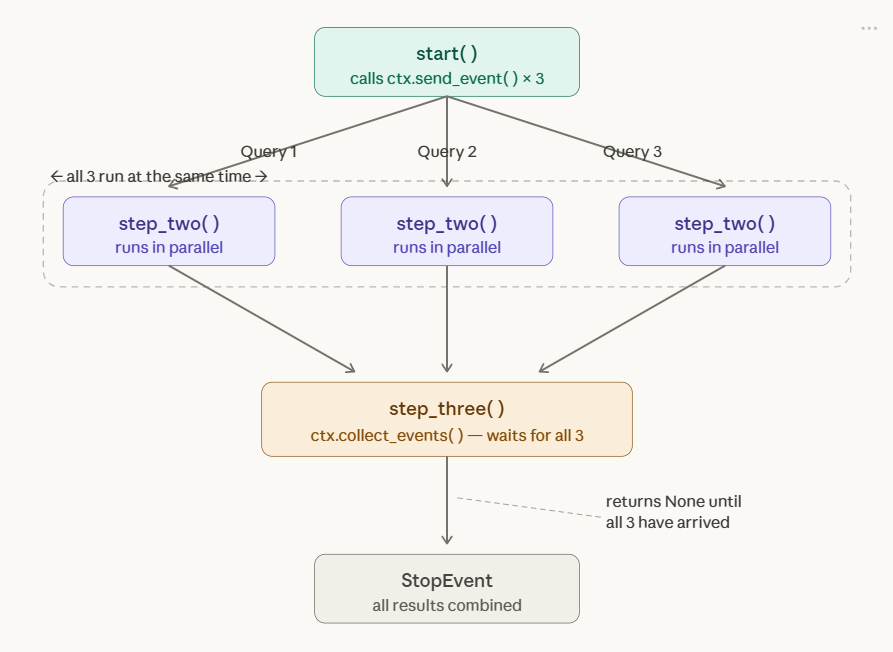
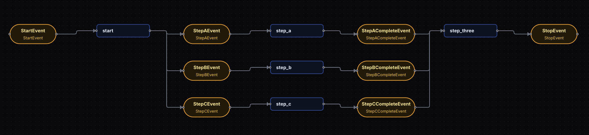

## **🔥🔥🔥What is Concurrency?**
```
When you have multiple independent steps that involve slow operations (like API calls or DB queries), running them sequentially wastes time. Concurrency lets them run simultaneously. 

Think of it like ordering food at a restaurant:
Without concurrency : you order a burger, wait for it, then order fries, wait for them, then order a drink. Total time = all waits added up.

With concurrency : you order everything at once. The kitchen makes all three simultaneously. You get everything faster.
```
<p align="center">

</p>

## **🔥🔥🔥Three Core Concepts**
**1. Emitting Multiple Events (ctx.send_event)**
```
=> Instead of returning a single event from a step, you call ctx.send_event() multiple times to fire off several events at once. 

=> Each one triggers an independent execution of the next step.

=> You can also set num_workers=4 on a step to allow up to 4 instances of it to run concurrently (this is the default).
```
```py
import asyncio
import random
from workflows import Workflow, Context, step
from workflows.events import Event, StartEvent, StopEvent

class StepTwoEvent(Event):
    query: str

class ParallelFlow(Workflow):
    @step
    async def start(self, ctx: Context, ev: StartEvent) -> StepTwoEvent | None:
        ctx.send_event(StepTwoEvent(query="Query 1"))
        ctx.send_event(StepTwoEvent(query="Query 2"))
        ctx.send_event(StepTwoEvent(query="Query 3"))

    @step(num_workers=4)
    async def step_two(self, ev: StepTwoEvent) -> StopEvent:
        print("Running slow query ", ev.query)
        await asyncio.sleep(random.randint(0, 5))

        return StopEvent(result=ev.query)
```

**2. Collecting Events (ctx.collect_events)**
```
=> The problem with parallel steps is knowing when they've all finished. 

=> collect_events solves this — it returns None until all the expected events have arrived, at which point it returns all of them together as a list. 

=> You typically return None early to "wait" and only proceed once the full set arrives.
```
```py
import asyncio
import random
from workflows import Workflow, Context, step
from workflows.events import Event, StartEvent, StopEvent

class StepTwoEvent(Event):
    query: str

class StepThreeEvent(Event):
    result: str

class ConcurrentFlow(Workflow):
    @step
    async def start(self, ctx: Context, ev: StartEvent) -> StepTwoEvent | None:
        ctx.send_event(StepTwoEvent(query="Query 1"))
        ctx.send_event(StepTwoEvent(query="Query 2"))
        ctx.send_event(StepTwoEvent(query="Query 3"))

    @step(num_workers=4)
    async def step_two(self, ctx: Context, ev: StepTwoEvent) -> StepThreeEvent:
        print("Running query ", ev.query)
        await asyncio.sleep(random.randint(1, 5))
        return StepThreeEvent(result=ev.query)

    @step
    async def step_three(
        self, ctx: Context, ev: StepThreeEvent
    ) -> StopEvent | None:
        # wait until we receive 3 events
        result = ctx.collect_events(ev, [StepThreeEvent] * 3)
        if result is None:
            return None

        # do something with all 3 results together
        print(result)
        return StopEvent(result="Done")
```

**3. Waiting for Different Event Types**
```
=> You're not limited to waiting for the same type of event. 

=> You can fan out to completely different steps (A, B, C) that each return different event types, then collect all three in a final step before proceeding. 

=> The order of the returned events matches the order you passed the types into collect_events, not the order they arrived.
```

```py
import asyncio
from workflows import Workflow, Context, step
from workflows.events import Event, StartEvent, StopEvent

class StepAEvent(Event):
    query: str

class StepBEvent(Event):
    query: str

class StepCEvent(Event):
    query: str

class StepACompleteEvent(Event):
    result: str

class StepBCompleteEvent(Event):
    result: str

class StepCCompleteEvent(Event):
    result: str


class ConcurrentFlow(Workflow):
    @step
    async def start(
        self, ctx: Context, ev: StartEvent
    ) -> StepAEvent | StepBEvent | StepCEvent | None:
        ctx.send_event(StepAEvent(query="Query 1"))
        ctx.send_event(StepBEvent(query="Query 2"))
        ctx.send_event(StepCEvent(query="Query 3"))

    @step
    async def step_a(self, ctx: Context, ev: StepAEvent) -> StepACompleteEvent:
        print("Doing something A-ish")
        return StepACompleteEvent(result=ev.query)

    @step
    async def step_b(self, ctx: Context, ev: StepBEvent) -> StepBCompleteEvent:
        print("Doing something B-ish")
        return StepBCompleteEvent(result=ev.query)

    @step
    async def step_c(self, ctx: Context, ev: StepCEvent) -> StepCCompleteEvent:
        print("Doing something C-ish")
        return StepCCompleteEvent(result=ev.query)

    @step
    async def step_three(
        self,
        ctx: Context,
        ev: StepACompleteEvent | StepBCompleteEvent | StepCCompleteEvent,
    ) -> StopEvent:
        print("Received event ", ev.result)

        # wait until we receive 3 events
        if (
            ctx.collect_events(
                ev,
                [StepCCompleteEvent, StepACompleteEvent, StepBCompleteEvent],
            )
            is None
        ):
            return None

        # do something with all 3 results together
        return StopEvent(result="Done")
```
Understanding the flow of code:
<p align="center">

</p>