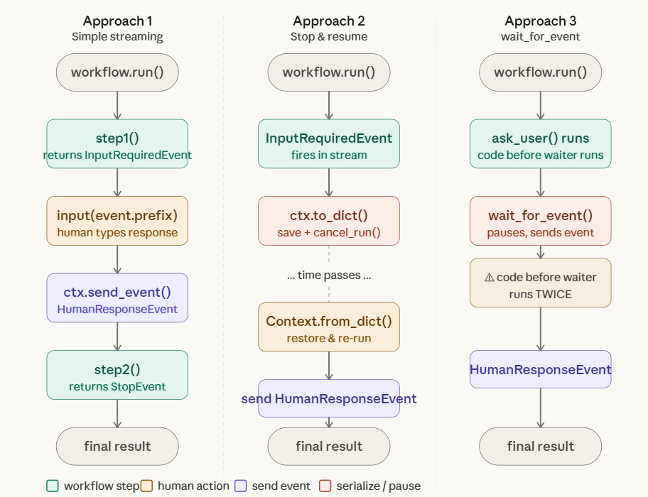
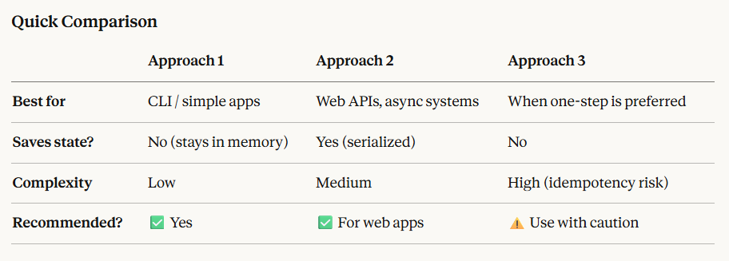

## 🔥🔥🔥**What is HITL ?**
```
=> HITL = Human In The Loop
=> It Talks about involvement of human at a particular Step, where AI cant take decision on its own
=> Imagine an AI writing an email:
        AI drafts the email
        It pauses and asks: “Should I send this?”
        Human says: “Yes” or “Edit this”
        AI acts based on that input
        👉 That pause + human input = Human-in-the-Loop

🔹 Simple explanation
        => AI does the task step-by-step
        => At particular step Human reviews, guides, or approves at certain steps for ex: Payment, Database access
        => Then AI continues
```
## **🔥🔥🔥There are 3 ways of Implementing Human In The Loop**

<p align="center">

</p>

### **🔥Approach 1: Simple Streaming (Two Steps)**
```
The workflow has two steps — one that asks a question, and one that handles the answer.

The workflow fires InputRequiredEvent like raising its hand. Your code catches it, collects input, then sends back a HumanResponseEvent to resume the workflow.
```
Lets Understand with Code:
```py
from workflows import Workflow, step
from workflows.events import StartEvent, StopEvent, InputRequiredEvent, HumanResponseEvent

class HumanInTheLoopWorkflow(Workflow):

    @step
    async def step1(self, ev: StartEvent) -> InputRequiredEvent:
        # Workflow pauses here and fires an InputRequiredEvent
        return InputRequiredEvent(prefix="What is your name? ")

    @step
    async def step2(self, ev: HumanResponseEvent) -> StopEvent:
        # Workflow resumes here once human responds
        return StopEvent(result=f"Hello, {ev.response}!")

workflow = HumanInTheLoopWorkflow()
handler = workflow.run()

async for event in handler.stream_events():
    if isinstance(event, InputRequiredEvent):
        # You see the question, collect the answer however you like
        response = input(event.prefix)  # e.g. user types "Alice"
        handler.ctx.send_event(HumanResponseEvent(response=response))

final_result = await handler
print(final_result)  # "Hello, Alice!"
```

### **🔥Approach 2: Stop & Resume Later (for web apps)**
```
Useful when the human response comes later — like via an HTTP request — and you can't just sit in a loop waiting.

You serialize (freeze) the workflow's memory, shut it down, store the state somewhere (DB, Redis, etc.), and later thaw it and inject the human's response to continue.
```
Lets Understand with Code:
```py
from workflows import Context

handler = workflow.run()

# --- Phase 1: Run until the question is asked, then PAUSE ---
async for event in handler.stream_events():
    if isinstance(event, InputRequiredEvent):
        # Save the entire workflow state as a JSON blob
        ctx_dict = handler.ctx.to_dict()  # e.g. store in a database
        await handler.cancel_run()        # stop the workflow for now
        break

# ... time passes, user submits a web form, etc. ...

# --- Phase 2: Restore and resume ---
response = "Alice"  # came in from an HTTP POST, for example
restored_ctx = Context.from_dict(workflow, ctx_dict)  # reload state
handler = workflow.run(ctx=restored_ctx)
handler.ctx.send_event(HumanResponseEvent(response=response))

async for event in handler.stream_events():
    continue

final_result = await handler
print(final_result)  # "Hello, Alice!"
```

### **🔥Approach 3: wait_for_event (single step, simpler but trickier)**
```
Instead of two steps, you pause inside a single step:
```
Lets Understand with Code:
```py
@step
async def ask_user(self, ctx: Context, ev: StartEvent) -> StopEvent:
    # Pauses here, sends InputRequiredEvent, waits for HumanResponseEvent
    response = await ctx.wait_for_event(
        HumanResponseEvent,
        waiter_event=InputRequiredEvent(prefix="What is your name? "),
        waiter_id="get_name",
    )
    return StopEvent(result=f"Hello, {response.response}!")
```
```
⚠️ The catch: Everything before wait_for_event runs twice (once to reach the pause, once when resuming). So if you do something like write to a database before it, that'll happen twice. The doc calls this needing to be idempotent — safe to repeat without side effects.
Because of this complexity, the two-step approach (Approach 1) is recommended unless you have a specific reason to use this.
```
<p align="center">

</p>

**1. wait_for_event** 
```
=> This is where your workflow actually stops and waits. and says: “I will not continue until I get the right response.”
=> It stops the Internal work flow and ask for a response.
=> it is used to wait for a HumanResponseEvent.
=> it is a Function / mechanism
```
**2. waiter_event**
```
=> it is the event that is written to the event stream, to let the caller know that we are waiting for a response.
=> This is an event you emit to tell the outside world: “I'm currently waiting for input.”
=> It is an object. 
```
**3. waiter_id** 
```
=> it is a unique identifier for this specific wait call. It helps ensure that we only send one waiter_event for each waiter_id.
=> Multiple waits can exist (especially in async or multi-agent flows)
        It Ensures:
            Only one “waiting” signal is emitted
            The correct response resumes the correct step
```
**4. requirements** 
```
=> argument is used to specify that we want to wait for a HumanResponseEvent with a specific user_name.
```

